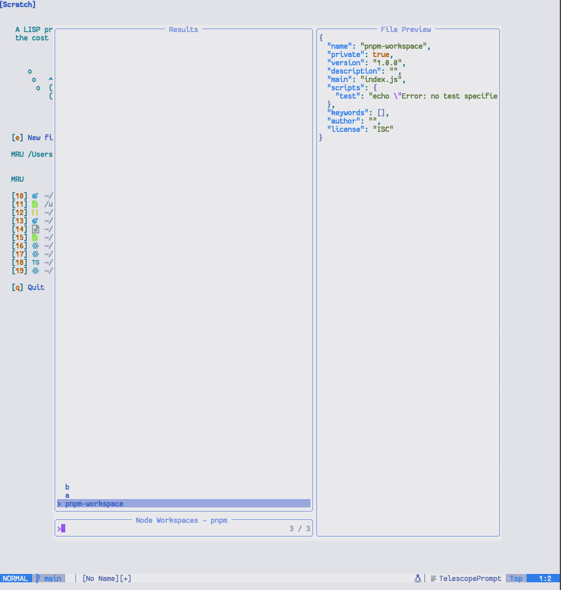

# telescope-node-workspace.nvim

Change your working directory between packages in a NodeJS workspace.

This plugin works with `yarn`, `npm`, `pnpm`, and `yarn-berry`. If you need
support for another package manager, please create an issue or submit a pull
request.



## Installation

With Packer:

```lua
use {
    "nvim-telescope/telescope.nvim",
    requires = {
        "ec965/telescope-node-workspace.nvim"
    }
}
```

## Usage

First, Load the telescope extension.

```lua
require('telescope').load_extension "node-workspace"
```

Then you can use `Telescope node-workspace` to pull up the telescope picker or you can kind it to a key.

```lua
-- bind it to a key
vim.keymap.set("n", "<leader>cdg", ":Telescope node-workspace<CR>", { noremap = true, silent = true })
```

Selecting an entry in the picker will change your current working directory to the directory of the chosen package.
The packages `package.json` is shown in the preview window.
